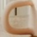
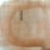

Description 
This is a project attempting to work with image optimization using GUROBI to perform minimization with the L1 norm, and DCT transformation using the three RGB channels 
First, we convert a bitmap image into 3 matrices in three color channels 
Then, we use apply forward Discrete Cosine Transform on them to induce sparsity in the matrix while still retaining meaningfull details 
We multiply these matrices with another measurement matrix to create a system in the form 
AB = C
Which is naturally underdetermined if B is not full rank 
Then we apply the L1 norm to find the X solution matrices approximating A through GUROBI, leveraging the created sparsity 
Then we perform backwards DCT, renormalize the image values and create the approximate output image 

Dependencies 
GUROBI (license), FFTW, ATL and Eigen are necessary to run the program 
Install ATL separately 
Put the library files for GUROBI, FFTW, and Eigen in the working directory and follow the .vcxproj file as the include and library files are stored deeper 

Configuration 
Upload the image to be processed into the "Images" folder, changing the file name in the main file as necessary, the original reconstructed image will be deleted as the program is run 
Set up the dimensions of B to control the degree of underdetermination of the system 
The output image will appear in the "Reconstruction" folder

Limitations 
The computation is very resource intensive, and so far I have only run a 63x63 image which is relatively fast for error shooting purposes 
To run larger computations, a large quantity of memory is necessary, as the main bottleneck is the storage of GUROBI variables